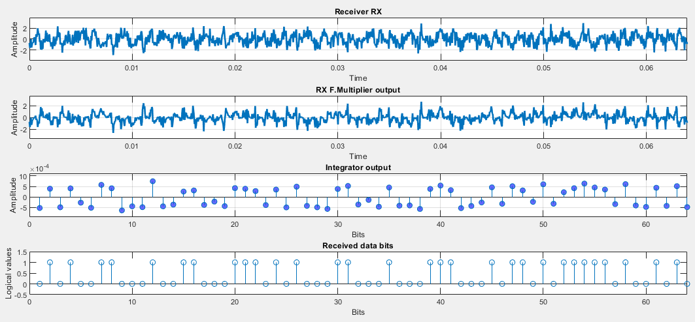

# BPSK system modeled and benchmarked against BER(SNR) [](https://www.mathworks.com/matlabcentral/fileexchange/79224-bpsk-system-modeled-and-benchmarked-against-ber-snr) [](https://github.com/etfovac/bpsk-ber/blob/master/LICENSE) [](https://github.com/etfovac/bpsk-ber/releases/tag/v1.0)

### Keywords:  
> BPSK,	Binary Phase Shift Keying  
> AWGN, Additive white Gaussian noise  
> SNR, Signal to Noise Ratio  
> BER,	Bit Error Rate  
> POE, Probability Of Error  
> Digital Signal processing  

## Overview
The simplest phase modulation, called Binary Phase Shift Keying (BPSK), uses two phases to encode two binary digits.  

Tx:  
The BPSK modulator is implemented using an input data set (0 and 1) which is sent to the input of the BPSK encoder which has assigned voltages of -1V and + 1V to this bit sequence. The encoder output is multiplied by the carrier cosine signal. The bits that will be transmitted are coded in the carrier's phase change.  

Rx:  
The integrator works as a low-pass filter and removes harmonics caused by multiplying the received signal by the carrier signal. The output of the integrator is led to a threshold detector which at the output reconstructs through 0 and 1.  

If the signal strength is sufficiently greater than the noise power at the link line, this detected bit sequence will be identical to the one sent.  

### Flowchart  
  
  

bit 1: 	s(t) = A cos(2πfct)    = +A cos(2πfct)   
bit 0: 	s(t) = A cos(2πfct+ π) = -A cos(2πfct)   

s(t) =  A d(t) cos(2πfct)   

r(t) = s(t) + n(t)   

  


### Model 1: BPSK Tx-Rx system  
MATLAB simulation models the following:
1. Creating BPSK symbols +1 and -1 from a randomly generated bit sequence (given length)
2. Adding white (Gaussian) noise (for a given difference between signal level and noise)
3. Detection of the received signal based on the reception threshold
4. Drawing input and output graphics

#### Example Results  
Configure and run script ```bpsk_transmission_system.m``` to understand the BPSK model.  

  
  

### Model 2: BER vs SNR in BPSK Tx-Rx system  
MATLAB simulation models the following:
1. Creating BPSK symbols +1 and -1 from a randomly generated bit sequence (given length)
2. Adding white (Gaussian) noise (for a given difference between signal level and noise)
3. Detection of the received signal based on the reception threshold
4. Counting errors and drawing BER graphics

For the assessment of BER, BPSK coding in the basic frequency range was used, ie. modulation and demodulation were not simulated (moving the signal to a higher frequency, then back to baseband) due to the faster execution of the simulation and because we are bencmarking only channel's influence modelled by AWGN.

Configure and run script ```bpsk_ber.m``` to generate BER vs SNR plots.  

#### Example Results  
  

```  
Input parameters:
Num of data bits to transfer through the channel = 5000 10000 50000 100000 500000 1e+06 5e+06 1e+07
SNR (dB) = -4.0 -2.0 0.0 2.0 4.0 6.0 8.0 10.0 12.0

* BPSK simulation *
Number of bits: 5000 
BER = -0.748119 for SNR = -4.0 
BER = -0.904482 for SNR = -2.0 
BER = -1.124939 for SNR = 0.0 
BER = -1.406714 for SNR = 2.0 
BER = -2.036212 for SNR = 4.0 
BER = -2.853872 for SNR = 6.0 
BER = -Inf for SNR = 8.0 
BER = -Inf for SNR = 10.0 
BER = -Inf for SNR = 12.0 

* BPSK simulation *
Number of bits: 10000 
BER = -0.729787 for SNR = -4.0 
BER = -0.892451 for SNR = -2.0 
BER = -1.112946 for SNR = 0.0 
BER = -1.383000 for SNR = 2.0 
BER = -1.920819 for SNR = 4.0 
BER = -2.795880 for SNR = 6.0 
BER = -Inf for SNR = 8.0 
BER = -Inf for SNR = 10.0 
BER = -Inf for SNR = 12.0 

...

* BPSK simulation *
Number of bits: 5e+06 
BER = -0.729917 for SNR = -4.0 
BER = -0.884020 for SNR = -2.0 
BER = -1.104215 for SNR = 0.0 
BER = -1.425779 for SNR = 2.0 
BER = -1.901612 for SNR = 4.0 
BER = -2.622876 for SNR = 6.0 
BER = -3.719422 for SNR = 8.0 
BER = -5.522879 for SNR = 10.0 
BER = -Inf for SNR = 12.0 

* BPSK simulation *
Number of bits: 1e+07 
BER = -0.729896 for SNR = -4.0 
BER = -0.884042 for SNR = -2.0 
BER = -1.105083 for SNR = 0.0 
BER = -1.427471 for SNR = 2.0 
BER = -1.902986 for SNR = 4.0 
BER = -2.618542 for SNR = 6.0 
BER = -3.728623 for SNR = 8.0 
BER = -5.376751 for SNR = 10.0 
BER = -Inf for SNR = 12.0  
``` 

### Results Analysis
The probability of incorrect bit detection (BER) is practically lost for a large SNR and is of the order of 1/N (1 bit in the sequence).  
All BER curves follow the theoretical BER curve with small deviations.  
 
The minimum SNR for which BPSK has 1 bit error depends on the total transmitted bits, so that for a larger number of transmitted bits, the SNR must be higher for the signal to be correctly reconstructed.  
For example: when transmitting 5 kb, it is enough for the SNR to exceed 6 dB so that there is no transmission error, while for the transmission of 5 Mb, the SNR must exceed 10 dB.  

[View BPSK system modeled and benchmarked against BER(SNR) on File Exchange](https://www.mathworks.com/matlabcentral/fileexchange/79224-bpsk-system-modeled-and-benchmarked-against-ber-snr)
